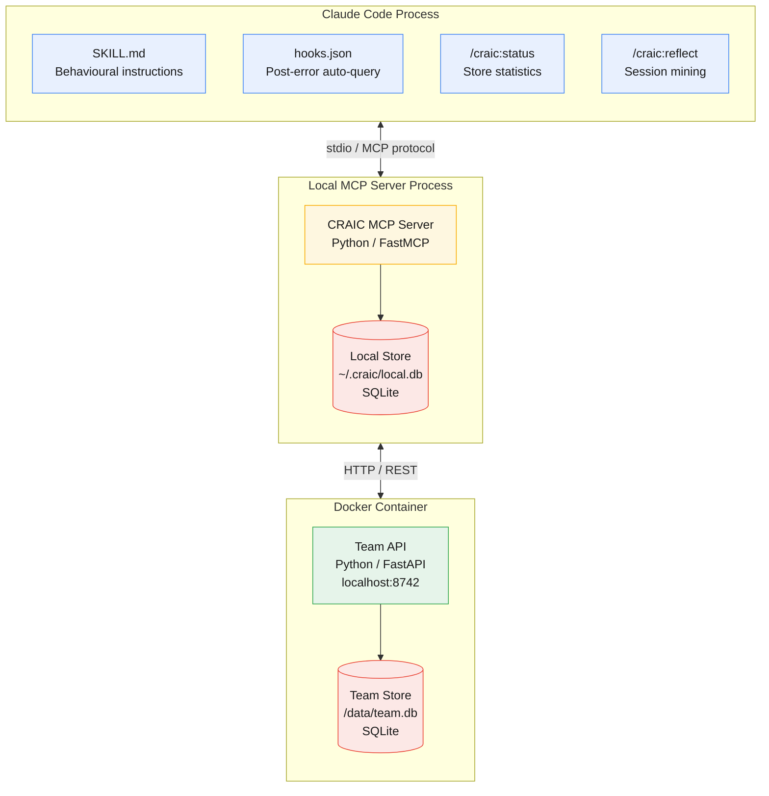
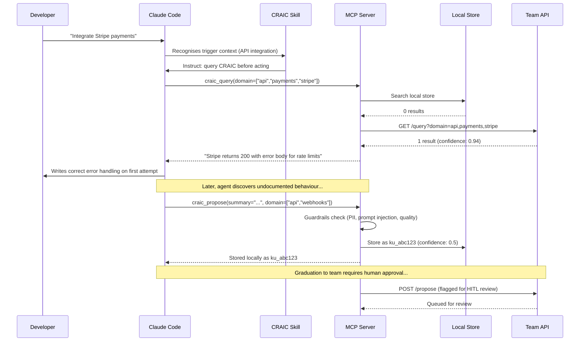
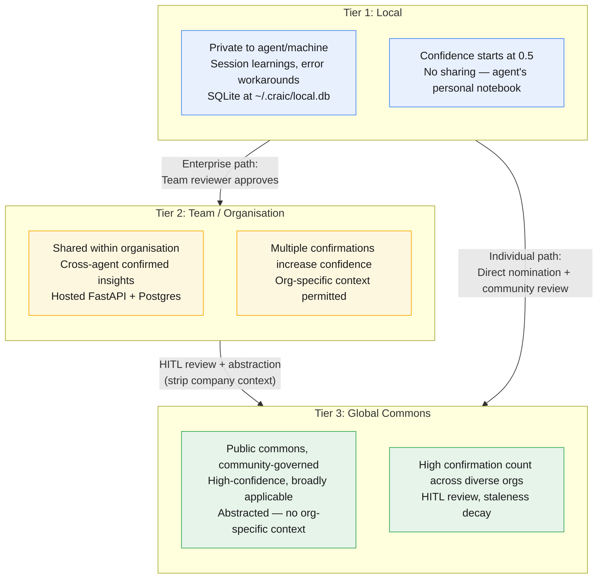
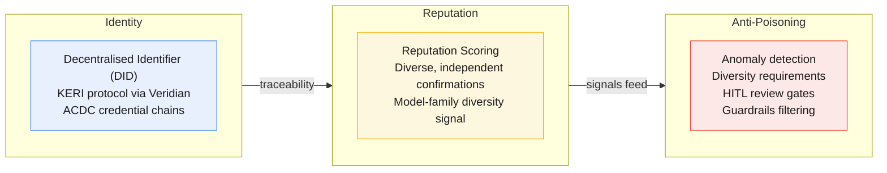
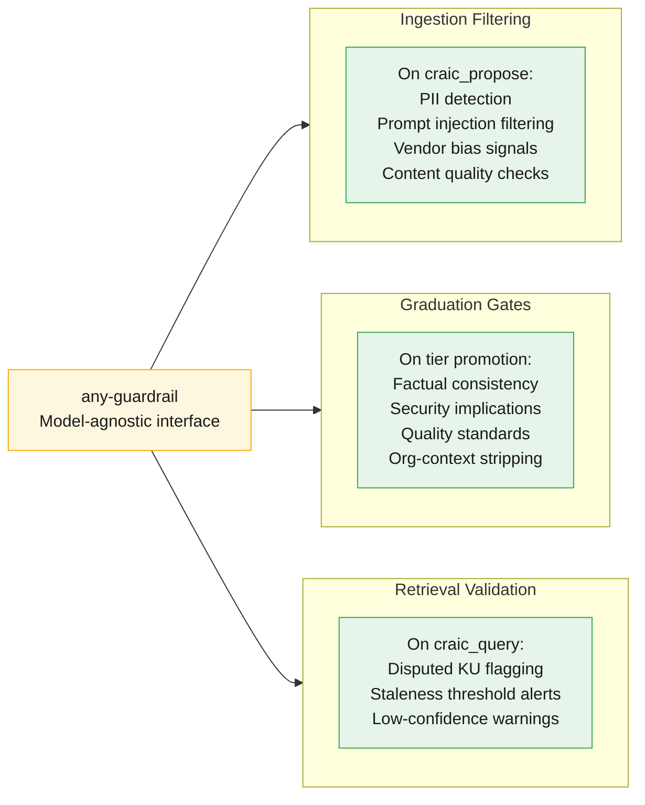
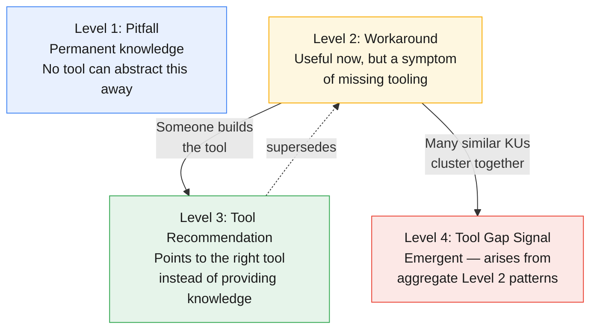
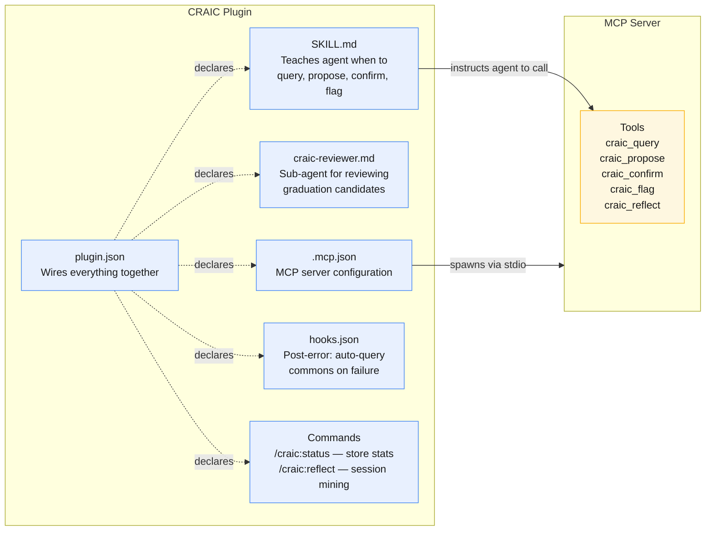
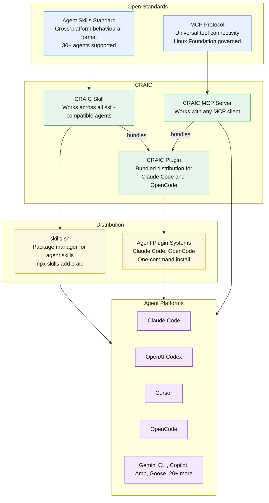

# CRAIC Architecture

This document describes the architecture of CRAIC (Collective Reciprocal Agent Intelligence Commons) through a series of diagrams covering system boundaries, knowledge flow, tiered storage, plugin structure, and ecosystem integration.

---

## 1. System Overview

CRAIC runs across three distinct runtime boundaries. Claude Code loads the plugin configuration files that shape agent behaviour. A local MCP server process handles all CRAIC logic and owns the private knowledge store. A Docker container runs the Team API independently for shared organisational knowledge.



**Claude Code** loads markdown and JSON configuration files. No CRAIC code runs inside the agent process itself.

**MCP Server** is spawned by Claude Code via stdio. It runs FastMCP, exposes five tools, and owns the local SQLite store at `~/.craic/local.db`.

**Docker Container** runs the Team API as an independent service (`docker compose up`). In production this would be a hosted service with authentication, tenancy, and RBAC.

---

## 2. Knowledge Flow

The core CRAIC loop: an agent queries shared knowledge before acting, incorporates what it finds, and proposes new knowledge when it discovers something novel.



The agent queries before writing code, avoiding repeated failures. When it discovers something novel, it proposes a new knowledge unit. The proposal passes through guardrails (PII detection, prompt injection filtering, quality checks) before entering the local store. Graduation to the team store is not automatic — it requires human approval through a review process. In the enterprise path, a team reviewer approves promotion; in the individual path, the contributor nominates local knowledge directly for global graduation.

---

## 3. Tier Architecture

Knowledge graduates upward through three tiers, each with increasing scope and trust requirements. The PoC implements Local and Team tiers. The Global tier represents the long-term vision.



There are two graduation paths to the global commons, reflecting different compliance requirements:

**Enterprise path (Local → Team → Global):** Organisations graduate knowledge through their team store first. Team reviewers verify quality, strip organisation-specific context, and ensure compliance with internal policies. Only knowledge that has passed internal HITL review is nominated for global graduation.

**Individual path (Local → Global):** Individual contributors not operating within an enterprise context can nominate local knowledge directly for global graduation. Automated guardrails plus community review provide the quality gate.

Both paths converge at the global graduation boundary, where HITL reviewers apply the same quality, safety, and generalisability standards regardless of source. The Global tier is out of scope for the PoC but is a core part of the long-term architecture.

---

## 3a. Trust Layer

The trust layer provides contributor traceability — not trust in the traditional sense. Reputation does not reduce scrutiny; every knowledge unit receives the same review regardless of contributor history.



**Identity** uses KERI (Key Event Receipt Infrastructure) for decentralised, blockchain-optional identity management. ACDC (Authentic Chained Data Containers) provides verifiable credential chains linking agents to their deploying organisations. Accountability flows through organisations and the people within them, not through agents directly.

**Reputation** is earned through diverse, independent confirmation. An insight confirmed by 3 agents from 3 independent organisations carries more weight than one confirmed by 800 agents from 2 organisations. Confirmation metadata includes model family; retrieval exposes a per-family breakdown so consuming agents can assess diversity at inference time without a storage-time penalty.

**Anti-poisoning** combines multiple mechanisms: anomaly detection flags disproportionate contribution volume; diversity requirements ensure confirmation comes from varied sources; HITL review gates knowledge graduation; and guardrails filter for safety and quality. Staking provides useful skin-in-the-game incentives but is one signal among many — weighted below independent peer confirmation and HITL review to avoid a "pay to pollute" vulnerability where well-funded actors absorb slashing costs.

> **Privacy layer (future work):** Midnight's zero-knowledge proof infrastructure enables selective disclosure — agents can prove a learning is valid without revealing the underlying details. This is designed but not yet implemented.

---

## 3b. Guardrails Layer

Guardrails are a core architectural component, not an afterthought. CRAIC integrates safety and quality checks at every stage of the knowledge lifecycle through three integration points.



**any-guardrail** provides a unified, model-agnostic interface for applying safety and quality checks. Because it is extensible, organisations can layer their own compliance rules on top of the baseline without forking the system. The broader guardrails ecosystem — Guardrails AI, NeMo Guardrails, LlamaGuard — provides complementary capabilities that plug in via any-guardrail's interface.

**Ingestion filtering** is the primary PII control. Automated guardrails handle PII detection; human reviewers focus on accuracy, relevance, quality, and generalisability.

**Graduation gates** run a more thorough assessment when knowledge is nominated for promotion between tiers — checking factual consistency, potential security implications, and alignment with quality standards.

**Retrieval-time validation** flags knowledge that has been disputed, is approaching staleness thresholds, or has low confidence relative to the agent's domain.

---

## 3c. Knowledge Unit Schema

Every piece of shared knowledge flows through a common structured format — `knowledge-unit.schema.json` — that ensures interoperability regardless of which agent produced or consumed the knowledge.

```json
{
  "id": "ku_a1b2c3d4e5f6",
  "version": "1.0.0",
  "domain": ["api", "payments", "error-handling"],
  "insight": {
    "summary": "Short description for fast scanning",
    "detail": "Fuller explanation of the issue",
    "action": "What the agent should do about it"
  },
  "context": {
    "language": ["typescript", "python"],
    "frameworks": [],
    "environment": "server-side",
    "pattern": "api-integration"
  },
  "evidence": {
    "severity": "high",
    "confidence": 0.94,
    "confirmations": 847,
    "contributing_orgs": 312,
    "first_observed": "2025-01-15T09:32:00Z",
    "last_confirmed": "2026-02-28T14:17:00Z",
    "last_queried_at": "2026-03-10T08:00:00Z"
  },
  "provenance": {
    "proposer_did": "did:keri:EXq5YqaL6L48pf0fu7IUhL0JRaU2_RxFP0AL43wYn148",
    "graduation_history": [
      {
        "from": "local", "to": "team",
        "approved_by": "human:alice@acme.dev",
        "timestamp": "2025-01-20T11:00:00Z"
      },
      {
        "from": "team", "to": "global",
        "approved_by": "human:reviewer_7f2a@craic.mozilla.ai",
        "timestamp": "2025-02-01T16:45:00Z"
      }
    ]
  },
  "lifecycle": {
    "status": "active",
    "kind": "pitfall",
    "staleness_policy": "confirm_or_decay_after_90d",
    "superseded_by": null,
    "related": [
      { "id": "ku_f7g8h9i0j1k2", "type": "extends" }
    ]
  }
}
```

Key design decisions:

- **`insight` is tripartite:** `summary` for fast scanning, `detail` for explanation, `action` for what to do. Agents need actionable guidance, not just observations.
- **`evidence` separates confidence from confirmations:** `contributing_orgs` is a diversity signal that feeds into anti-poisoning. Confirmation metadata includes model family; per-family breakdowns are exposed at retrieval time.
- **`provenance` is the audit trail:** Every graduation step records the human reviewer's DID and timestamp. This makes CRAIC EU AI Act compliant by design.
- **`lifecycle.kind`** classifies knowledge units as `pitfall`, `workaround`, or `tool-recommendation`. This drives the Level 1–4 lifecycle described in section 3d.
- **`lifecycle.related`** supports typed relationships: `supersedes`, `contradicts`, `extends`, `requires`.
- **`last_queried_at` and `last_confirmed_at`** enable unused KU eviction. Knowledge units that are neither queried nor confirmed within a configurable retention window are soft-deleted (tombstoned), keeping the commons clean without destroying provenance.

---

## 3d. Knowledge Unit Lifecycle

Not all knowledge is the same. Knowledge units exist on a spectrum from permanent knowledge to tool ecosystem intelligence. The `kind` field drives lifecycle behaviour.



**Level 1 — Pitfall warnings** are permanent residents. "Stripe API returns HTTP 200 with an error body for rate-limited requests." No tool will change this.

**Level 2 — Workaround recipes** are useful now but represent a gap in tooling. If a better tool existed, agents would not need this knowledge. These should eventually be superseded.

**Level 3 — Tool recommendations** point agents to the right tool rather than providing knowledge directly. This is what a Level 2 becomes after someone builds the tool — the original workaround gets `superseded_by` the recommendation.

**Level 4 — Tool gap signals** are emergent. No single contributor creates them. When enough Level 2 KUs cluster around the same problem area, the aggregate pattern reveals a missing tool. This signal — with quantitative evidence across organisations — can drive ecosystem investment decisions.

This classification makes the commons more than a knowledge store. It becomes an intelligence layer for the agent tooling ecosystem: which tools are working well, where tools are missing, and where investment is needed.

---

## 3e. Storage Architecture

The tiered architecture implies different storage characteristics at each level. The specification defines API contracts independently of the backing store — implementations can vary.

| Tier | Backing Store | Characteristics |
|------|--------------|-----------------|
| **Tier 1: Local** | SQLite / embedded | Fast, offline-capable, private. Data never leaves the machine unless explicitly graduated. |
| **Tier 2: Team** | Postgres + pgvector | Multi-user access, RBAC, hybrid keyword + semantic search. Natural home for the enterprise SaaS offering. |
| **Tier 3: Global** | Federated / decentralised | Publicly readable, highly available, resistant to single points of failure. Content-addressed storage for immutability and provenance. |

The API contract — how agents read and write knowledge units via MCP tools — remains stable regardless of what storage sits underneath. The PoC uses SQLite for both Local and Team tiers; production deployments can swap in appropriate backends without changing the agent-facing interface.

---

## 4. Plugin Anatomy

The CRAIC plugin bundles everything an agent needs into a single installable unit. Each component serves a distinct role.



**SKILL.md** is the behavioural layer. It teaches the agent *when* to use CRAIC tools: query before unfamiliar API calls, propose when discovering undocumented behaviour, confirm when knowledge proves correct, flag when it is wrong or stale.

**MCP Server** exposes five tools over stdio. The agent calls these tools based on the Skill's instructions. The server handles local storage, team API communication, confidence scoring, and query matching.

**Hooks** trigger automatically. The post-error hook instructs the agent to call `craic_query` with the error context before attempting a fix.

**Commands** are developer-facing. `/craic:status` shows store statistics. `/craic:reflect` triggers retrospective session mining — it catches long-tail knowledge that real-time hooks miss, ranks candidates by estimated generalisability, and checks the commons for existing coverage before proposing (surfacing existing KUs rather than creating duplicates). Candidates are presented for human approval.

**plugin.json** is the manifest that declares all components and wires them together for one-command installation.

---

## 5. MCP Ecosystem Integration

CRAIC is built entirely on existing open standards. It does not introduce new protocols or runtimes — it packages a knowledge commons into the distribution formats that developers already use.



**Three integration paths** serve different adoption levels:

1. **MCP Server only** — any MCP-compatible agent can connect to the CRAIC MCP server and use the knowledge tools directly. This is the universal floor.

2. **Skill via skills.sh** — installs `SKILL.md` and MCP configuration. Works across 30+ agents that support the Agent Skills standard. The Skill adds judgement: it teaches the agent *when* and *why* to call the tools.

3. **Full Plugin** — bundles the Skill, MCP server, hooks, commands, and manifest into a one-command install for Claude Code, OpenCode, and other plugin-compatible agents. This is the richest experience.

The ecosystem convergence on MCP and Agent Skills means CRAIC does not need to convince developers to adopt new protocols. It plugs into the infrastructure they already have.

> **Domain scope:** The initial implementation targets coding agents — the domain where agent tooling is most mature and adoption is fastest. The underlying mechanism (structured knowledge sharing via MCP with tiered trust) generalises to arbitrary domains: DevOps, security, data engineering, and beyond.
